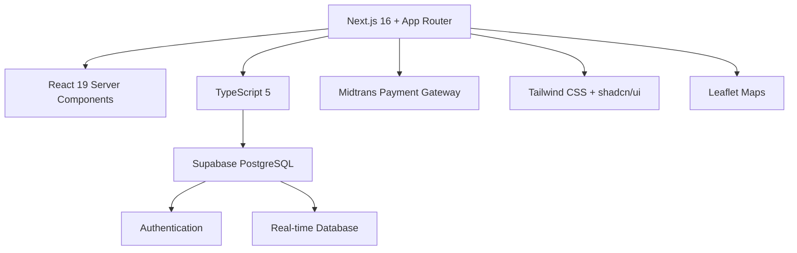

# Courtease - Learning Documentation

Project-based learning documentation untuk memahami codebase Courtease dari dasar.

## Table of Contents
📚 **Complete Documentation:**
1. **[Next.js App Router](./docs/01-nextjs-app-router.md)** - Server Components, Routing, API Routes
2. **[Supabase Configuration](./docs/02-supabase-config.md)** - Database setup, Security, Client types
3. **[Authentication System](./docs/03-authentication-flow.md)** - User management, Roles, Session handling
4. **[Midtrans Payment Integration](./docs/04-midtrans-integration.md)** - Payment gateway, Webhook handling
5. **[Booking System](./docs/05-booking-system.md)** - Core logic, Database schema, Real-time features

📖 **Master Guide:** **[docs/README.md](./docs/README.md)** - Complete learning roadmap

## Quick Start

### Environment Variables yang Dibutuhkan:
```env
# Supabase
NEXT_PUBLIC_SUPABASE_URL=https://your-project.supabase.co
NEXT_PUBLIC_SUPABASE_ANON_KEY=your-anon-key
SUPABASE_SERVICE_ROLE_KEY=your-service-role-key

# Midtrans
MIDTRANS_SERVER_KEY=your-server-key
NEXT_PUBLIC_MIDTRANS_CLIENT_KEY=your-client-key
MIDTRANS_SNAP_BASE_URL=https://app.sandbox.midtrans.com
MIDTRANS_API_BASE_URL=https://api.sandbox.midtrans.com
```

### Learning Path (4 Hari):
- **Hari 1**: Next.js App Router + Supabase Configuration
- **Hari 2**: Authentication System + Role Management
- **Hari 3**: Midtrans Payment Integration
- **Hari 4**: Booking System + Database Optimization

## Official Documentation Sources

### Next.js
- [App Router Documentation](https://nextjs.org/docs/app)
- [Server Components](https://nextjs.org/docs/app/building-your-application/rendering/server-components)
- [Route Handlers](https://nextjs.org/docs/app/building-your-application/routing/route-handlers)

### Supabase
- [JavaScript Client Reference](https://supabase.com/docs/reference/javascript)
- [Auth with Next.js](https://supabase.com/docs/guides/auth/server-side/nextjs)
- [Row Level Security](https://supabase.com/docs/guides/auth/row-level-security)

### Midtrans
- [Snap Integration Guide](https://docs.midtrans.com/en/snap/integration-guide)
- [Core API Reference](https://docs.midtrans.com/en/core-api)
- [Node.js Client](https://github.com/midtrans/midtrans-nodejs-client)

## YouTube Tutorial References (2024)

1. **Next.js 14 + Supabase Full Course**: [Watch Here](https://youtube.com/watch?v=Cvu0t-Phl7A)
2. **Supabase Auth Deep Dive**: [Watch Here](https://youtube.com/watch?v=1i7gU81n3e0)
3. **Server vs Client Components**: [Watch Here](https://youtube.com/watch?v=dDpZx9y_8Z0)
4. **Midtrans Integration Tutorial**: [Watch Here](https://youtube.com/watch?v=example)
5. **Payment Gateway Best Practices**: [Watch Here](https://youtube.com/watch?v=example)

## Stack Overview



## Code Quality Checklist

### ✅ Security
- [ ] Environment variables validation
- [ ] Input sanitization & validation
- [ ] Row Level Security (RLS) policies
- [ ] Service role key server-only usage
- [ ] CSRF protection

### ✅ Performance
- [ ] Server Components for data fetching
- [ ] Image optimization
- [ ] Code splitting
- [ ] Database indexing
- [ ] Caching strategy

### ✅ Type Safety
- [ ] TypeScript strict mode
- [ ] Runtime validation
- [ ] Proper error handling
- [ ] Type guards

---

**Generated**: 2025-11-20
**Version**: 1.0.0