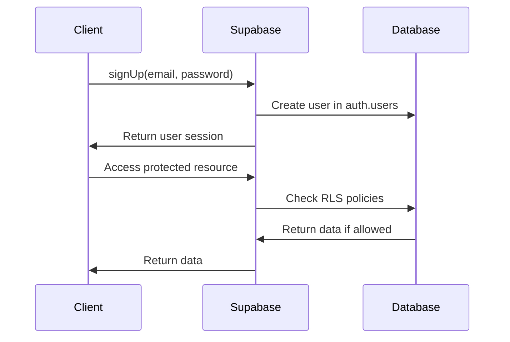

# Supabase Configuration Deep Dive

## Konsep Dasar Supabase

Supabase adalah Backend-as-a-Service (BaaS) yang menyediakan:
- **PostgreSQL Database** dengan real-time subscriptions
- **Authentication** system dengan berbagai providers
- **Storage** untuk file management
- **Edge Functions** untuk serverless logic

**Sumber:** [Supabase Overview](https://supabase.com/docs)

## Environment Variables Setup

### Required Environment Variables
```env
# Supabase Project Configuration
NEXT_PUBLIC_SUPABASE_URL=https://your-project.supabase.co
NEXT_PUBLIC_SUPABASE_ANON_KEY=your-anon-key-here
SUPABASE_SERVICE_ROLE_KEY=your-service-role-key-here
```

### Variable Types & Security

#### 1. NEXT_PUBLIC_SUPABASE_URL
- **Type**: Public (client-side accessible)
- **Format**: `https://[project-id].supabase.co`
- **Purpose**: Supabase project URL untuk API calls

#### 2. NEXT_PUBLIC_SUPABASE_ANON_KEY
- **Type**: Public (client-side accessible)
- **Purpose**: Limited access key untuk client operations
- **Limitations**: Subject to Row Level Security (RLS)

#### 3. SUPABASE_SERVICE_ROLE_KEY
- **Type**: Private (server-only!)
- **Purpose**: Full admin access ke database
- **Warning**: Bisa bypass SEMUA RLS policies

**Sumber:** [Environment Variables Guide](https://supabase.com/docs/guides/auth/auth-helpers/nextjs#env-variables)

### Configuration Validation
```typescript
// lib/supabase/config.ts
export const supabaseConfig = {
  url: process.env.NEXT_PUBLIC_SUPABASE_URL,
  anonKey: process.env.NEXT_PUBLIC_SUPABASE_ANON_KEY,
  serviceRoleKey: process.env.SUPABASE_SERVICE_ROLE_KEY,
};

export function validateSupabaseConfig() {
  if (!supabaseConfig.url) {
    throw new Error("NEXT_PUBLIC_SUPABASE_URL is not configured");
  }

  if (!supabaseConfig.url.startsWith("https://")) {
    throw new Error("NEXT_PUBLIC_SUPABASE_URL must start with https://");
  }

  if (!supabaseConfig.anonKey) {
    throw new Error("NEXT_PUBLIC_SUPABASE_ANON_KEY is not configured");
  }

  if (supabaseConfig.anonKey.length < 100) {
    console.warn("NEXT_PUBLIC_SUPABASE_ANON_KEY seems too short");
  }
}
```

## Client Types Deep Dive

### 1. Browser Client (Client Components)
```typescript
// lib/supabase/client.ts
import { createBrowserClient } from "@supabase/ssr";

export function createClient() {
  return createBrowserClient(
    supabaseConfig.url!,
    supabaseConfig.anonKey!
  );
}
```

**Usage:**
```typescript
// components/auth/login-form.tsx
"use client";
import { createClient } from "@/lib/supabase/client";

export default function LoginForm() {
  const supabase = createClient();

  const handleLogin = async () => {
    const { error } = await supabase.auth.signInWithPassword({
      email,
      password,
    });
  };
}
```

**Sumber:** [Browser Client Documentation](https://supabase.com/docs/reference/javascript/auth-signup#browser-client)

### 2. Server Client (Server Components)
```typescript
// lib/supabase/server.ts
import { createServerClient } from "@supabase/ssr";
import { cookies } from "next/headers";

export async function createClient() {
  const cookieStore = await cookies();

  return createServerClient(
    supabaseConfig.url!,
    supabaseConfig.anonKey!,
    {
      cookies: {
        getAll() {
          return cookieStore.getAll();
        },
        setAll(cookiesToSet) {
          cookiesToSet.forEach(({ name, value, options }) =>
            cookieStore.set(name, value, options)
          );
        },
      },
    }
  );
}
```

**Usage:**
```typescript
// app/page.tsx
import { createClient } from "@/lib/supabase/server";

export default async function Home() {
  const supabase = await createClient();
  const { data: courts } = await supabase.from('courts').select('*');

  return <main>{...}</main>;
}
```

**Sumber:** [Server Client Documentation](https://supabase.com/docs/guides/auth/server-side/nextjs#create-a-server-client)

### 3. Admin Client (Special Server Client)
```typescript
// lib/supabase/server.ts
export async function createAdminClient() {
  if (!supabaseConfig.serviceRoleKey) {
    throw new Error("SUPABASE_SERVICE_ROLE_KEY is required for admin operations");
  }

  const cookieStore = await cookies();

  return createServerClient(
    supabaseConfig.url!,
    supabaseConfig.serviceRoleKey!, // ← Key difference!
    {
      cookies: { /* ... */ }
    }
  );
}
```

**Usage:**
```typescript
// app/api/admin/users/route.ts
import { createAdminClient } from "@/lib/supabase/server";

export async function GET() {
  const supabase = await createAdminClient();

  // ✅ Can access ALL users (bypass RLS)
  const { data: users } = await supabase.auth.admin.listUsers();

  return NextResponse.json(users);
}
```

## Authentication System Architecture

### Supabase Auth Flow


### User Metadata vs App Data

#### User Metadata (Built-in)
```typescript
// Stored in auth.users.raw_user_meta_data
const { data, error } = await supabase.auth.signUp({
  email: 'user@example.com',
  password: 'password',
  options: {
    data: {
      full_name: 'John Doe',
    }
  }
});
```

**Access:**
```typescript
const { data: { user } } = await supabase.auth.getUser();
console.log(user.user_metadata.full_name); // 'John Doe'
```

#### App-specific Data (Custom Tables)
```sql
-- profiles table untuk role management
CREATE TABLE profiles (
  id UUID REFERENCES auth.users(id) PRIMARY KEY,
  role TEXT DEFAULT 'user',
  phone TEXT,
  created_at TIMESTAMP DEFAULT NOW(),
  updated_at TIMESTAMP DEFAULT NOW()
);
```

**Sumber:** [User Management Guide](https://supabase.com/docs/guides/auth/overview#user-management)

## Row Level Security (RLS)

### Enable RLS
```sql
ALTER TABLE profiles ENABLE ROW LEVEL SECURITY;
```

### RLS Policies
```sql
-- Users can read their own profile
CREATE POLICY "Users can view own profile" ON profiles
  FOR SELECT USING (auth.uid() = id);

-- Users can update their own profile
CREATE POLICY "Users can update own profile" ON profiles
  FOR UPDATE USING (auth.uid() = id);

-- Users can insert their own profile
CREATE POLICY "Users can insert own profile" ON profiles
  FOR INSERT WITH CHECK (auth.uid() = id);
```

**Sumber:** [Row Level Security Guide](https://supabase.com/docs/guides/auth/row-level-security)

## Database Schema Design

### Recommended Schema Structure
```sql
-- Profiles table (extends auth.users)
CREATE TABLE profiles (
  id UUID REFERENCES auth.users(id) PRIMARY KEY,
  full_name TEXT,
  role TEXT DEFAULT 'user' CHECK (role IN ('user', 'venue_partner', 'admin')),
  phone TEXT,
  created_at TIMESTAMP DEFAULT NOW(),
  updated_at TIMESTAMP DEFAULT NOW()
);

-- Venues table
CREATE TABLE venues (
  id UUID DEFAULT gen_random_uuid() PRIMARY KEY,
  name TEXT NOT NULL,
  description TEXT,
  address TEXT,
  latitude DECIMAL(10, 8),
  longitude DECIMAL(11, 8),
  owner_id UUID REFERENCES profiles(id),
  created_at TIMESTAMP DEFAULT NOW(),
  updated_at TIMESTAMP DEFAULT NOW()
);

-- Courts table
CREATE TABLE courts (
  id UUID DEFAULT gen_random_uuid() PRIMARY KEY,
  venue_id UUID REFERENCES venues(id) ON DELETE CASCADE,
  name TEXT NOT NULL,
  sport_type TEXT NOT NULL,
  hourly_price DECIMAL(10, 2),
  created_at TIMESTAMP DEFAULT NOW()
);

-- Bookings table
CREATE TABLE bookings (
  id UUID DEFAULT gen_random_uuid() PRIMARY KEY,
  court_id UUID REFERENCES courts(id),
  user_id UUID REFERENCES profiles(id),
  start_time TIMESTAMP WITH TIME ZONE NOT NULL,
  end_time TIMESTAMP WITH TIME ZONE NOT NULL,
  status TEXT DEFAULT 'pending' CHECK (status IN ('pending', 'confirmed', 'cancelled')),
  total_amount DECIMAL(10, 2),
  created_at TIMESTAMP DEFAULT NOW()
);
```

### Database Indexes for Performance
```sql
-- Index untuk queries yang sering dipakai
CREATE INDEX idx_profiles_role ON profiles(role);
CREATE INDEX idx_venues_owner_id ON venues(owner_id);
CREATE INDEX idx_courts_venue_id ON courts(venue_id);
CREATE INDEX idx_bookings_user_id ON bookings(user_id);
CREATE INDEX idx_bookings_court_id ON bookings(court_id);
CREATE INDEX idx_bookings_status ON bookings(status);
```

## Real-time Subscriptions

### Server-side Real-time
```typescript
// app/api/live-updates/route.ts
import { createClient } from "@/lib/supabase/server";

export async function GET() {
  const supabase = await createClient();

  // Subscribe ke booking changes
  supabase
    .channel('bookings')
    .on('postgres_changes',
      { event: '*', schema: 'public', table: 'bookings' },
      (payload) => {
        console.log('Booking changed:', payload);
      }
    )
    .subscribe();

  return NextResponse.json({ subscribed: true });
}
```

### Client-side Real-time
```typescript
// components/realtime-bookings.tsx
"use client";
import { useEffect } from 'react';
import { createClient } from "@/lib/supabase/client";

export default function RealtimeBookings() {
  useEffect(() => {
    const supabase = createClient();

    const channel = supabase
      .channel('bookings')
      .on('postgres_changes',
        { event: '*', schema: 'public', table: 'bookings' },
        (payload) => {
          // Update UI based on changes
          console.log('Real-time update:', payload);
        }
      )
      .subscribe();

    return () => supabase.removeChannel(channel);
  }, []);

  return <div>Listening for booking updates...</div>;
}
```

**Sumber:** [Realtime Documentation](https://supabase.com/docs/guides/realtime)

## Error Handling & Best Practices

### Error Handling Pattern
```typescript
// lib/supabase/utils.ts
export async function handleSupabaseError<T>(
  operation: () => Promise<{ data: T | null; error: any }>
): Promise<{ data: T | null; error: string | null }> {
  try {
    const { data, error } = await operation();

    if (error) {
      console.error('Supabase error:', error);
      return { data: null, error: error.message };
    }

    return { data, error: null };
  } catch (err) {
    console.error('Unexpected error:', err);
    return {
      data: null,
      error: err instanceof Error ? err.message : 'Unknown error'
    };
  }
}
```

### Usage Example
```typescript
const { data: user, error } = await handleSupabaseError(async () => {
  return await supabase
    .from('profiles')
    .select('*')
    .eq('id', userId)
    .single();
});
```

## Security Best Practices

### 1. Always Use RLS
```sql
-- Enable RLS on ALL user data tables
ALTER TABLE profiles ENABLE ROW LEVEL SECURITY;
ALTER TABLE venues ENABLE ROW LEVEL SECURITY;
ALTER TABLE bookings ENABLE ROW LEVEL SECURITY;
```

### 2. Validate Service Role Key Usage
```typescript
// Helper function untuk admin operations
export async function requireAdminClient() {
  if (!supabaseConfig.serviceRoleKey) {
    throw new Error('Service role key required for admin operations');
  }
  return await createAdminClient();
}
```

### 3. Environment Variable Security
```typescript
// Never expose service role key to client
export function createClient() {
  // ✅ Safe: uses anon key
  return createBrowserClient(url, anonKey);
}

// ❌ DANGEROUS: Never do this!
export function createAdminClientForBrowser() {
  return createBrowserClient(url, serviceRoleKey); // SECURITY RISK!
}
```

### 4. Input Validation
```typescript
// API route validation
export async function POST(request: Request) {
  const body = await request.json();

  // Validate input
  const email = typeof body.email === 'string' ? body.email.trim() : '';
  const password = typeof body.password === 'string' ? body.password : '';

  if (!email || !password) {
    return NextResponse.json(
      { error: 'Email and password required' },
      { status: 400 }
    );
  }

  // Continue with auth...
}
```

## Performance Optimization

### 1. Database Connections
```typescript
// Reuse connections in server components
let supabaseInstance: ReturnType<typeof createClient>;

export async function getSupabaseClient() {
  if (!supabaseInstance) {
    supabaseInstance = await createClient();
  }
  return supabaseInstance;
}
```

### 2. Query Optimization
```typescript
// ✅ Select only needed columns
const { data } = await supabase
  .from('bookings')
  .select('id, status, total_amount')
  .eq('user_id', userId);

// ✅ Use pagination for large datasets
const { data } = await supabase
  .from('venues')
  .select('*')
  .range(0, 19) // Limit 20 items
  .order('created_at', { ascending: false });
```

### 3. Caching Strategy
```typescript
// Cache frequently accessed data
const cachedVenues = new Map<string, any>();

export async function getCachedVenues(forceRefresh = false) {
  if (!cachedVenues.has('venues') || forceRefresh) {
    const supabase = await createClient();
    const { data } = await supabase.from('venues').select('*');
    cachedVenues.set('venues', data);
  }

  return cachedVenues.get('venues');
}
```

---

**Key Takeaways:**
1. **Separate client types** for different use cases
2. **Always use RLS** for data security
3. **Validate inputs** in API routes
4. **Protect service role key** from client exposure
5. **Optimize queries** for performance
6. **Handle errors gracefully** throughout the app
