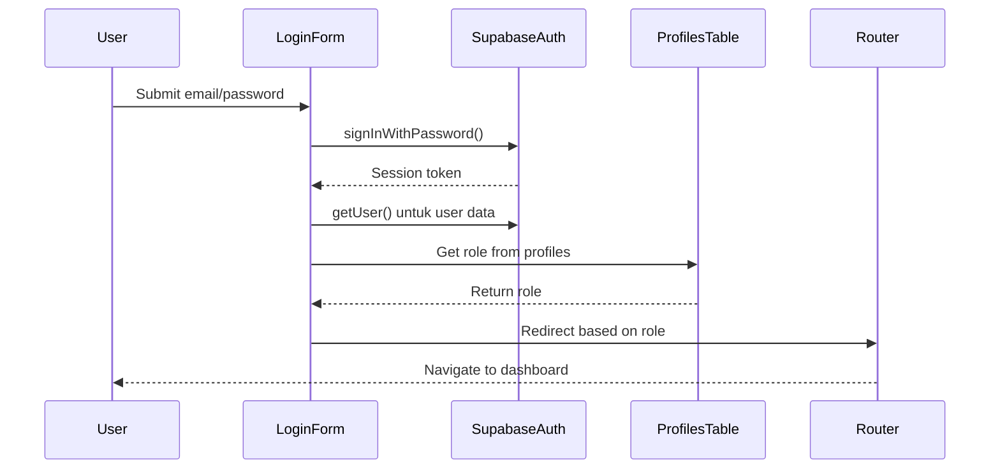

# Authentication System Deep Dive

## Overview

Authentication system di Courtease menggunakan Supabase Auth dengan custom role management melalui `profiles` table.

## Architecture Flow



## Registration Flow

### Registration Component Analysis
```typescript
// components/auth/register-form.tsx
const { data, error } = await supabase.auth.signUp({
  email,
  password,
  options: {
    data: {
      full_name: fullName, // Custom user metadata
    },
  },
});

// Create profile record after successful registration
if (user) {
  const { error: profileError } = await supabase.from("profiles").upsert({
    id: user.id,
    full_name: fullName,
    role: "user", // Default role
  });
}
```

**Sumber:** [Supabase signUp Documentation](https://supabase.com/docs/reference/javascript/auth-signup)

### Registration Steps:
1. **Input Validation**: Email dan password validation
2. **Supabase Auth**: Create user di auth.users table
3. **User Metadata**: Store full_name di user metadata
4. **Profile Creation**: Create record di custom profiles table
5. **Default Role**: Set role ke 'user' secara default
6. **Success Redirect**: Arahkan ke login page

## Login Flow Analysis

### Complete Login Process
```typescript
// components/auth/login-form.tsx
export function LoginForm() {
  const handleSubmit = async (event: FormEvent<HTMLFormElement>) => {
    // 1. Input validation
    const formData = new FormData(event.currentTarget);
    const email = String(formData.get("email") ?? "").trim();
    const password = String(formData.get("password") ?? "");

    if (!email || !password) {
      toast.error("Email dan password wajib diisi");
      return;
    }

    // 2. Authentication
    const supabase = createClient();
    const { error } = await supabase.auth.signInWithPassword({
      email,
      password,
    });

    if (error) {
      throw error;
    }

    // 3. Get current user session
    const {
      data: { user },
    } = await supabase.auth.getUser();

    if (!user) {
      router.push("/");
      return;
    }

    // 4. Role checking from profiles table
    const { data: profile, error: profileError } = await supabase
      .from("profiles")
      .select("role")
      .eq("id", user.id)
      .maybeSingle();

    // 5. Handle missing profile
    const role = (profile?.role as AppRole | null) ?? "user";

    if (!profile) {
      // Auto-create profile if missing
      await supabase
        .from("profiles")
        .upsert({ id: user.id, role: role })
        .select("role")
        .maybeSingle();
    }

    // 6. Role-based routing
    router.replace(DASHBOARD_BY_ROLE[role] ?? DASHBOARD_BY_ROLE.user);
  };
}
```

### Role-based Routing
```typescript
// components/auth/login-form.tsx
const DASHBOARD_BY_ROLE: Record<AppRole, string> = {
  admin: "/dashboard/admin",
  venue_partner: "/dashboard/venue",
  user: "/", // Homepage
};
```

**Sumber:** [App Router Navigation](https://nextjs.org/docs/app/building-your-application/routing/navigation)

## Role Management System

### Role Types
```typescript
// lib/supabase/roles.ts
export type AppRole = "user" | "venue_partner" | "admin";

export const ROLE_PERMISSIONS = {
  user: [
    "view:venues",
    "create:bookings",
    "view:own_bookings",
    "participate:forum"
  ],
  venue_partner: [
    "view:venues",
    "create:bookings",
    "view:own_bookings",
    "manage:own_venues",
    "view:own_bookings",
    "participate:forum"
  ],
  admin: [
    "view:venues",
    "create:bookings",
    "view:all_bookings",
    "manage:all_venues",
    "manage:users",
    "view:analytics"
  ]
};
```

### Database Schema for Role Management
```sql
-- profiles table extends auth.users
CREATE TABLE profiles (
  id UUID REFERENCES auth.users(id) PRIMARY KEY,
  full_name TEXT,
  role TEXT DEFAULT 'user' CHECK (role IN ('user', 'venue_partner', 'admin')),
  phone TEXT,
  avatar_url TEXT,
  created_at TIMESTAMP DEFAULT NOW(),
  updated_at TIMESTAMP DEFAULT NOW()
);

-- Enable RLS
ALTER TABLE profiles ENABLE ROW LEVEL SECURITY;

-- Policies
CREATE POLICY "Users can view own profile" ON profiles
  FOR SELECT USING (auth.uid() = id);

CREATE POLICY "Users can update own profile" ON profiles
  FOR UPDATE USING (auth.uid() = id);
```

**Sumber:** [Row Level Security Guide](https://supabase.com/docs/guides/auth/row-level-security)

## Session Management

### Server-side Session Checking
```typescript
// lib/supabase/server.ts
export async function createClient() {
  const cookieStore = await cookies();

  return createServerClient(
    supabaseConfig.url!,
    supabaseConfig.anonKey!,
    {
      cookies: {
        getAll() {
          return cookieStore.getAll(); // Read session cookies
        },
        setAll(cookiesToSet) {
          try {
            cookiesToSet.forEach(({ name, value, options }) =>
              cookieStore.set(name, value, options) // Set session cookies
            );
          } catch {
            // Server Component can't set cookies directly
            // Middleware handles session refresh
          }
        },
      },
    }
  );
}
```

### Protected Routes Middleware
```typescript
// middleware.ts
import { createServerClient } from '@supabase/ssr';
import { NextResponse } from 'next/server';
import type { NextRequest } from 'next/server';

export async function middleware(request: NextRequest) {
  const supabase = createServerClient(
    process.env.NEXT_PUBLIC_SUPABASE_URL!,
    process.env.NEXT_PUBLIC_SUPABASE_ANON_KEY!,
    {
      cookies: {
        getAll() {
          return request.cookies.getAll();
        },
        setAll(cookiesToSet) {
          cookiesToSet.forEach(({ name, value, options }) => {
            request.cookies.set(name, value);
          });
        },
      },
    }
  );

  // Refresh session if expired
  const {
    data: { session },
  } = await supabase.auth.getSession();

  // Protected routes logic
  const protectedRoutes = ['/dashboard', '/admin'];
  const isProtectedRoute = protectedRoutes.some(route =>
    request.nextUrl.pathname.startsWith(route)
  );

  if (!session && isProtectedRoute) {
    return NextResponse.redirect(new URL('/auth/login', request.url));
  }

  return NextResponse.next({
    request: {
      headers: request.headers,
    },
  });
}

export const config = {
  matcher: ['/((?!api|_next/static|_next/image|favicon.ico).*)'],
};
```

**Sumber:** [Middleware Documentation](https://nextjs.org/docs/app/building-your-application/middleware)

## OAuth Integration (Google)

### Setup di Supabase Dashboard
1. **Supabase Project** → **Authentication** → **Providers**
2. **Enable Google provider**
3. **Tambahkan Google OAuth credentials**
4. **Set redirect URL**: `https://your-domain.com/auth/callback`

### Google OAuth Implementation
```typescript
// components/auth/google-login-button.tsx
"use client";

import { createClient } from "@/lib/supabase/client";

export function GoogleLoginButton() {
  const supabase = createClient();

  const handleGoogleLogin = async () => {
    const { error } = await supabase.auth.signInWithOAuth({
      provider: 'google',
      options: {
        queryParams: {
          access_type: 'offline',
          prompt: 'consent',
        },
        redirectTo: `${window.location.origin}/auth/callback`,
      },
    });

    if (error) {
      console.error('Google login error:', error);
    }
  };

  return (
    <button onClick={handleGoogleLogin}>
      Login with Google
    </button>
  );
}
```

### OAuth Callback Handler
```typescript
// app/auth/callback/route.ts
import { createClient } from '@/lib/supabase/server';
import { NextRequest, NextResponse } from 'next/server';

export async function GET(request: NextRequest) {
  const { searchParams, origin } = new URL(request.url);
  const code = searchParams.get('code');
  const next = searchParams.get('next') ?? '/';

  if (code) {
    const supabase = await createClient();
    const { error } = await supabase.auth.exchangeCodeForSession(code);

    if (!error) {
      // Create profile if doesn't exist
      const { data: { user } } = await supabase.auth.getUser();

      if (user) {
        const { data: profile } = await supabase
          .from('profiles')
          .select('role')
          .eq('id', user.id)
          .maybeSingle();

        if (!profile) {
          await supabase.from('profiles').insert({
            id: user.id,
            full_name: user.user_metadata?.full_name || user.email?.split('@')[0],
            role: 'user'
          });
        }
      }

      return NextResponse.redirect(`${origin}${next}`);
    }
  }

  // return the user to an error page with instructions
  return NextResponse.redirect(`${origin}/auth/auth-code-error`);
}
```

**Sumber:** [OAuth Documentation](https://supabase.com/docs/guides/auth/social-login/auth-google)

## Password Recovery

### Forgot Password Flow
```typescript
// components/auth/forgot-password-form.tsx
const handleResetPassword = async (email: string) => {
  const supabase = createClient();

  const { error } = await supabase.auth.resetPasswordForEmail(email, {
    redirectTo: `${window.location.origin}/auth/update-password`,
  });

  if (error) {
    toast.error('Gagal mengirim link reset password');
  } else {
    toast.success('Link reset password telah dikirim');
  }
};
```

### Update Password Flow
```typescript
// components/auth/update-password-form.tsx
const handleUpdatePassword = async (newPassword: string) => {
  const supabase = createClient();

  const { error } = await supabase.auth.updateUser({
    password: newPassword
  });

  if (error) {
    toast.error('Gagal update password');
  } else {
    toast.success('Password berhasil diupdate');
    router.push('/auth/login');
  }
};
```

**Sumber:** [Password Recovery Documentation](https://supabase.com/docs/guides/auth/auth-helpers/nextjs#password-recovery)

## Security Best Practices

### 1. Input Sanitization
```typescript
// Utils function for email validation
export function sanitizeEmail(email: unknown): string {
  const emailStr = String(email ?? '').trim().toLowerCase();
  const emailRegex = /^[^\s@]+@[^\s@]+\.[^\s@]+$/;

  if (!emailRegex.test(emailStr)) {
    throw new Error('Invalid email format');
  }

  return emailStr;
}

// Usage in login form
const email = sanitizeEmail(formData.get('email'));
```

### 2. Rate Limiting
```typescript
// lib/rate-limiter.ts
import { LRUCache } from 'lru-cache';

const rateLimit = new LRUCache<string, number>({
  max: 500, // Max 500 users
  ttl: 1000 * 60 * 15, // 15 minutes
});

export function checkRateLimit(identifier: string, limit: number = 5): boolean {
  const current = rateLimit.get(identifier) || 0;

  if (current >= limit) {
    return false; // Rate limited
  }

  rateLimit.set(identifier, current + 1);
  return true;
}

// Usage in API route
export async function POST(request: Request) {
  const ip = request.ip || 'unknown';

  if (!checkRateLimit(ip, 5)) {
    return NextResponse.json(
      { error: 'Too many attempts. Try again later.' },
      { status: 429 }
    );
  }

  // Continue with authentication...
}
```

### 3. Session Security
```typescript
// lib/session-security.ts
export async function validateSession(request: Request) {
  const supabase = await createClient();

  const { data: { session }, error } = await supabase.auth.getSession();

  if (error || !session) {
    return { valid: false, user: null };
  }

  // Check if session is expired
  if (session.expires_at && session.expires_at * 1000 < Date.now()) {
    return { valid: false, user: null };
  }

  return { valid: true, user: session.user };
}
```

## Error Handling

### Custom Error Messages
```typescript
// lib/auth-errors.ts
export const AUTH_ERROR_MESSAGES = {
  'Invalid login credentials': 'Email atau password salah',
  'Email not confirmed': 'Silakan konfirmasi email terlebih dahulu',
  'User already registered': 'Email sudah terdaftar',
  'Password should be at least 6 characters': 'Password minimal 6 karakter',
  'Invalid email': 'Format email tidak valid',
  'Too many requests': 'Terlalu banyak percobaan, coba lagi nanti',
};

export function getAuthErrorMessage(error: any): string {
  return AUTH_ERROR_MESSAGES[error.message] || error.message || 'Terjadi kesalahan';
}

// Usage in auth components
catch (error: unknown) {
  const message = getAuthErrorMessage(error);
  toast.error('Login gagal', { description: message });
}
```

### Error Boundaries
```typescript
// components/auth-error-boundary.tsx
'use client';

export function AuthErrorBoundary({ children }: { children: React.ReactNode }) {
  return (
    <div className="auth-container">
      <ErrorBoundary
        fallback={
          <div className="error-fallback">
            <h2>Terjadi kesalahan pada system auth</h2>
            <p>Silakan coba lagi atau hubungi support</p>
          </div>
        }
      >
        {children}
      </ErrorBoundary>
    </div>
  );
}
```

## Testing Authentication

### Test Scenarios
```typescript
// tests/auth.test.ts
describe('Authentication Flow', () => {
  test('User can register with valid credentials', async () => {
    const testUser = {
      email: 'test@example.com',
      password: 'password123',
      full_name: 'Test User'
    };

    // Test registration
    const { data, error } = await supabase.auth.signUp({
      email: testUser.email,
      password: testUser.password,
      options: {
        data: { full_name: testUser.full_name }
      }
    });

    expect(error).toBeNull();
    expect(data.user).toBeDefined();
    expect(data.user?.email).toBe(testUser.email);
  });

  test('User can login with valid credentials', async () => {
    // Test login
    const { data, error } = await supabase.auth.signInWithPassword({
      email: 'test@example.com',
      password: 'password123'
    });

    expect(error).toBeNull();
    expect(data.session).toBeDefined();
  });

  test('Role-based routing works correctly', async () => {
    // Test admin user redirect
    const adminUser = await createTestUser({ role: 'admin' });
    const redirectPath = getDashboardPath(adminUser.role);
    expect(redirectPath).toBe('/dashboard/admin');

    // Test regular user redirect
    const regularUser = await createTestUser({ role: 'user' });
    const userRedirectPath = getDashboardPath(regularUser.role);
    expect(userRedirectPath).toBe('/');
  });
});
```

---

**Key Takeaways:**
1. **Dual storage**: Supabase auth + custom profiles table
2. **Role-based routing**: Dynamic dashboard based on user role
3. **Session management**: Server-side session validation
4. **OAuth integration**: Google login with profile auto-creation
5. **Security**: Input validation, rate limiting, proper error handling
6. **Testing**: Comprehensive test scenarios for all auth flows
