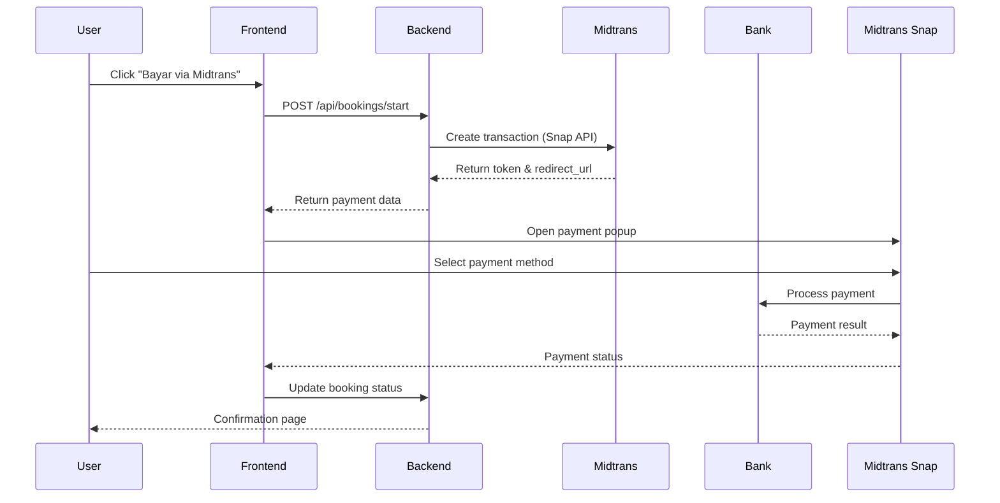

# Midtrans Payment Integration Deep Dive

## Konsep Dasar Midtrans

Midtrans adalah **Payment Gateway** - jembatan antara aplikasi kamu dengan berbagai payment providers (bank, e-wallet, dll).

**Sumber:** [Midtrans Documentation](https://docs.midtrans.com)

## Architecture Overview



## Environment Configuration

### Required Environment Variables
```env
# Midtrans Configuration
MIDTRANS_SERVER_KEY=Midtrans-server-key-here
NEXT_PUBLIC_MIDTRANS_CLIENT_KEY=Midtrans-client-key-here

# Optional (override defaults)
MIDTRANS_SNAP_BASE_URL=https://app.sandbox.midtrans.com
MIDTRANS_API_BASE_URL=https://api.sandbox.midtrans.com
```

### Environment Type
- **Sandbox**: Untuk development/testing
- **Production**: Untuk live payments

**Sumber:** [Midtrans Environment Guide](https://docs.midtrans.com/en/snap/integration-guide#test-and-production-environment)

## Core Midtrans Integration

### 1. Server Configuration
```typescript
// lib/payments/midtrans.ts
const MIDTRANS_SERVER_KEY = process.env.MIDTRANS_SERVER_KEY;
const MIDTRANS_SNAP_BASE_URL = process.env.MIDTRANS_SNAP_BASE_URL ??
  "https://app.sandbox.midtrans.com";
const MIDTRANS_API_BASE_URL = process.env.MIDTRANS_API_BASE_URL ??
  "https://api.sandbox.midtrans.com";
```

### 2. Type Definitions
```typescript
// Type safety untuk Midtrans data
export type MidtransCustomer = {
  firstName?: string | null;
  email?: string | null;
};

export type MidtransItem = {
  id: string;
  price: number;
  quantity: number;
  name?: string | null;
};

export type CreateMidtransTransactionParams = {
  orderId: string;
  amount: number;
  courtName?: string | null;
  customer?: MidtransCustomer | null;
  items?: MidtransItem[] | null;
  successRedirectUrl?: string | null;
};
```

### 3. Transaction Creation
```typescript
// lib/payments/midtrans.ts
export async function createMidtransTransaction({
  orderId,
  amount,
  courtName,
  customer,
  items,
  successRedirectUrl,
}: CreateMidtransTransactionParams): Promise<{
  token: string;
  redirect_url: string | null;
}> {
  // 1. Validation
  if (!MIDTRANS_SERVER_KEY) {
    throw new MidtransTransactionError(
      "Midtrans belum dikonfigurasi",
      { status: 500 }
    );
  }

  if (!Number.isFinite(amount) || amount <= 0) {
    throw new MidtransTransactionError(
      "Jumlah pembayaran tidak valid",
      { status: 400 }
    );
  }

  // 2. Prepare payload
  const payload: Record<string, unknown> = {
    transaction_details: {
      order_id: orderId.trim(),
      gross_amount: amount,
    },
    customer_details: sanitizeCustomer(customer ?? null),
    item_details: sanitizeItems(items ?? null, courtName ?? null, amount),
    credit_card: {
      secure: true, // 3D Secure untuk kartu kredit
    },
  };

  // 3. Add callbacks jika ada
  if (successRedirectUrl && successRedirectUrl.trim()) {
    payload.callbacks = {
      finish: successRedirectUrl.trim(),
    };
  }

  // 4. Call Midtrans API
  const response = await fetch(
    `${MIDTRANS_SNAP_BASE_URL}/snap/v1/transactions`,
    {
      method: "POST",
      headers: {
        "Content-Type": "application/json",
        Authorization: `Basic ${Buffer.from(`${MIDTRANS_SERVER_KEY}:`).toString(
          "base64"
        )}`,
      },
      body: JSON.stringify(payload),
    }
  );

  // 5. Handle response
  if (!response.ok) {
    const detail = await response.text().catch(() => null);
    throw new MidtransTransactionError(
      "Gagal membuat transaksi Midtrans",
      { status: 502, detail }
    );
  }

  const data = await response.json();

  // 6. Extract token (support both token & snap_token)
  const token = (() => {
    if (typeof data.token === "string" && data.token.trim()) {
      return data.token;
    }
    if (typeof data.snap_token === "string" && data.snap_token.trim()) {
      return data.snap_token;
    }
    return null;
  })();

  if (!token) {
    throw new MidtransTransactionError(
      "Midtrans mengembalikan respons tidak valid",
      { status: 502, detail: data }
    );
  }

  return {
    token,
    redirect_url: data.redirect_url || null,
  };
}
```

**Sumber:** [Snap API Documentation](https://docs.midtrans.com/en/snap/integration-guide#step-1-get-snap-token)

## Data Sanitization & Validation

### Item Sanitization Function
```typescript
// lib/payments/midtrans.ts
function sanitizeItems(
  items: MidtransItem[] | null | undefined,
  fallbackName: string | null | undefined,
  amount: number
) {
  const normalized = Array.isArray(items) ? items : [];
  const validItems = normalized
    .map((item) => ({
      id: typeof item.id === "string" ? item.id.trim() : "",
      price: Number(item.price),
      quantity: Number(item.quantity),
      name: item.name ?? fallbackName ?? "Booking Lapangan CourtEase",
    }))
    .filter(
      (item): item is {
        id: string;
        price: number;
        quantity: number;
        name: string;
      } =>
        Boolean(item.id) &&
        Number.isFinite(item.price) &&
        item.price > 0 &&
        Number.isFinite(item.quantity) &&
        item.quantity > 0
    );

  // Fallback ke default item jika tidak ada valid items
  if (validItems.length > 0) {
    return validItems;
  }

  return [
    {
      id: "court-reservation",
      price: amount,
      quantity: 1,
      name: fallbackName ?? "Booking Lapangan CourtEase",
    },
  ];
}
```

### Customer Sanitization Function
```typescript
function sanitizeCustomer(customer: MidtransCustomer | null | undefined) {
  const first_name =
    typeof customer?.firstName === "string" && customer.firstName.trim()
      ? customer.firstName.trim()
      : "CourtEase User";

  const email =
    typeof customer?.email === "string" && customer.email.trim()
      ? customer.email.trim()
      : "no-reply@courtease.id";

  return { first_name, email };
}
```

## Status Handling & Mapping

### Transaction Status Checking
```typescript
// lib/payments/midtrans.ts
export async function getMidtransTransactionStatus(
  orderId: string
): Promise<MidtransStatusResponse | null> {
  if (!MIDTRANS_SERVER_KEY) {
    console.warn("Midtrans server key is not configured");
    return null;
  }

  const response = await fetch(
    `${MIDTRANS_API_BASE_URL}/v2/${encodeURIComponent(orderId.trim())}/status`,
    {
      method: "GET",
      headers: {
        Accept: "application/json",
        Authorization: `Basic ${Buffer.from(`${MIDTRANS_SERVER_KEY}:`).toString(
          "base64"
        )}`,
      },
    }
  );

  if (!response.ok) {
    console.error("Failed to fetch Midtrans transaction status", {
      status: response.status,
      statusText: response.statusText,
    });
    return null;
  }

  return await response.json().catch(() => null);
}
```

**Sumber:** [Status API Documentation](https://docs.midtrans.com/en/credit-card/get-transaction-status)

### Status Mapping to Application
```typescript
// lib/payments/midtrans.ts
export function mapMidtransStatusToBooking(
  status: MidtransStatusResponse | null
): { paymentStatus: PaymentStatus; bookingStatus: BookingStatus } | null {
  if (!status) return null;

  const transactionStatus = normalizeMidtransValue(status.transaction_status);
  const fraudStatus = normalizeMidtransValue(status.fraud_status);

  switch (transactionStatus) {
    case "settlement":
      return { paymentStatus: "paid", bookingStatus: "confirmed" };

    case "capture":
      if (fraudStatus === "challenge") {
        return {
          paymentStatus: "waiting_confirmation",
          bookingStatus: "pending",
        };
      }
      return { paymentStatus: "paid", bookingStatus: "confirmed" };

    case "authorize":
      return {
        paymentStatus: "waiting_confirmation",
        bookingStatus: "pending",
      };

    case "pending":
      return { paymentStatus: "pending", bookingStatus: "pending" };

    case "expire":
    case "expired":
      return { paymentStatus: "expired", bookingStatus: "cancelled" };

    case "deny":
    case "cancel":
    case "failure":
      return { paymentStatus: "cancelled", bookingStatus: "cancelled" };

    case "refund":
    case "partial_refund":
    case "chargeback":
    case "partial_chargeback":
      return { paymentStatus: "cancelled", bookingStatus: "cancelled" };

    default:
      return null;
  }
}
```

## Frontend Integration

### Midtrans Client Component
```typescript
// components/venues/midtrans-booking-button.tsx
"use client";

export function MidtransBookingButton({
  courtId,
  isConfigured,
  midtransClientKey,
  snapScriptUrl,
  isBookingAllowed,
  selectedSlot,
  notes,
}: MidtransBookingButtonProps) {
  const [isLoading, setIsLoading] = useState(false);
  const [snapReady, setSnapReady] = useState(false);

  const handleClick = useCallback(async () => {
    // 1. Validation checks
    if (!isConfigured || !isBookingAllowed || !selectedSlot) {
      // Show appropriate error messages
      return;
    }

    setIsLoading(true);

    try {
      // 2. Get user session
      const supabase = createClient();
      const { data: { user } } = await supabase.auth.getUser();

      if (!user) {
        toast.info("Perlu login");
        return;
      }

      // 3. Create booking via API
      const response = await fetch("/api/bookings/start", {
        method: "POST",
        headers: { "Content-Type": "application/json" },
        body: JSON.stringify({
          courtId,
          startTime: selectedSlot.start.toISOString(),
          endTime: selectedSlot.end.toISOString(),
          notes: notes?.trim() ? notes.trim() : undefined,
        }),
      });

      const payload = await response.json();

      if (!response.ok) {
        throw new Error(payload.error ?? "Tidak dapat membuat booking baru.");
      }

      // 4. Extract payment data
      const {
        data: {
          bookingId,
          payment: { token, redirectUrl },
        },
      } = payload;

      // 5. Prepare success URL
      const successRedirectUrl = `${window.location.origin}/dashboard/user/bookings/${bookingId}`;

      // 6. Open Midtrans Snap popup
      if (window.snap && typeof window.snap.pay === "function" && snapReady) {
        window.snap.pay(token, {
          onSuccess: () => {
            toast.success("Pembayaran berhasil");
            window.location.assign(successRedirectUrl);
          },
          onPending: () => {
            toast.info("Menunggu pembayaran");
          },
          onError: (error) => {
            console.error("Midtrans Snap error", error);
            toast.error("Pembayaran dibatalkan");
          },
        });
      } else if (redirectUrl) {
        // Fallback to direct redirect
        window.location.href = redirectUrl;
      }
    } catch (error) {
      // Error handling
    } finally {
      setIsLoading(false);
    }
  }, [/* dependencies */]);

  // 7. Load Midtrans Snap script
  return (
    <>
      {midtransClientKey && (
        <Script
          src={snapScriptUrl}
          data-client-key={midtransClientKey}
          onLoad={() => setSnapReady(true)}
          strategy="lazyOnload"
        />
      )}

      <Button
        onClick={handleClick}
        disabled={isLoading || !isConfigured || !isBookingAllowed || !selectedSlot}
      >
        {isLoading ? "Menghubungkan Midtrans..." : "Bayar via Midtrans"}
      </Button>
    </>
  );
}
```

**Sumber:** [Snap Client Integration](https://docs.midtrans.com/en/snap/integration-guide#step-2-display-snap-popup)

### Type Definitions for Window Interface
```typescript
// Global interface untuk Midtrans Snap
declare global {
  interface Window {
    snap?: {
      pay: (
        token: string,
        options?: {
          onSuccess?: (result: unknown) => void;
          onPending?: (result: unknown) => void;
          onError?: (error: unknown) => void;
          onClose?: () => void;
        },
      ) => void;
    };
  }
}
```

## Backend API Integration

### Booking Creation API
```typescript
// app/api/bookings/start/route.ts
export async function POST(request: Request) {
  const body = await request.json();

  // 1. Input validation
  const { courtId, startTime, endTime, notes } = body;

  // 2. Get user session
  const supabase = await createClient();
  const { data: { user } } = await supabase.auth.getUser();

  if (!user) {
    return NextResponse.json(
      { error: "Authentication required" },
      { status: 401 }
    );
  }

  // 3. Create booking record
  const { data: booking, error: bookingError } = await supabase
    .from("bookings")
    .insert({
      court_id: courtId,
      user_id: user.id,
      start_time: startTime,
      end_time: endTime,
      status: "pending",
      total_amount: calculateTotalAmount(startTime, endTime), // Calculate from court price
      notes,
    })
    .select()
    .single();

  if (bookingError) {
    return NextResponse.json(
      { error: "Failed to create booking" },
      { status: 500 }
    );
  }

  // 4. Create Midtrans transaction
  try {
    const { data: court } = await supabase
      .from("courts")
      .select("name, hourly_price")
      .eq("id", courtId)
      .single();

    const { token, redirect_url } = await createMidtransTransaction({
      orderId: booking.id,
      amount: booking.total_amount,
      courtName: court.name,
      customer: {
        firstName: user.user_metadata?.full_name || user.email?.split('@')[0],
        email: user.email!,
      },
      items: [{
        id: courtId,
        name: court.name,
        price: court.hourly_price,
        quantity: calculateHours(startTime, endTime),
      }],
      successRedirectUrl: `${process.env.NEXTAUTH_URL}/dashboard/user/bookings/${booking.id}`,
    });

    // 5. Update booking with payment token
    await supabase
      .from("bookings")
      .update({ payment_token: token })
      .eq("id", booking.id);

    return NextResponse.json({
      data: {
        bookingId: booking.id,
        payment: { token, redirectUrl: redirect_url },
      },
    });

  } catch (error) {
    // Cleanup booking if payment creation fails
    await supabase
      .from("bookings")
      .delete()
      .eq("id", booking.id);

    throw error;
  }
}
```

### Payment Status Webhook
```typescript
// app/api/payments/midtrans/webhook/route.ts
export async function POST(request: Request) {
  const body = await request.json();

  // 1. Verify webhook signature (important!)
  const signature = request.headers.get('x-callback-signature');
  if (!verifyWebhookSignature(body, signature)) {
    return NextResponse.json(
      { error: "Invalid signature" },
      { status: 401 }
    );
  }

  // 2. Extract transaction data
  const { order_id, transaction_status, fraud_status, payment_type } = body;

  // 3. Update booking status
  const statusMapping = mapMidtransStatusToBooking({
    order_id,
    transaction_status,
    fraud_status,
    payment_type,
  });

  if (statusMapping) {
    const supabase = await createClient();

    await supabase
      .from("bookings")
      .update({
        payment_status: statusMapping.paymentStatus,
        status: statusMapping.bookingStatus,
        updated_at: new Date().toISOString(),
      })
      .eq("id", order_id);
  }

  return NextResponse.json({ status: "ok" });
}
```

**Sumber:** [HTTP Notification Guide](https://docs.midtrans.com/en/credit-card/http-notification)

## Error Handling

### Custom Error Class
```typescript
// lib/payments/midtrans.ts
export class MidtransTransactionError extends Error {
  readonly status: number;
  readonly detail?: unknown;

  constructor(
    message: string,
    options: { status?: number; detail?: unknown } = {}
  ) {
    super(message);
    this.name = "MidtransTransactionError";
    this.status = options.status ?? 500;
    this.detail = options.detail;
  }
}
```

### Error Handling in API Routes
```typescript
// app/api/payments/midtrans/route.ts
export async function POST(request: Request) {
  try {
    // ... payment logic

  } catch (error) {
    if (error instanceof MidtransTransactionError) {
      // Log detailed error for debugging
      if (error.detail) {
        console.error("Midtrans error", error.detail);
      }

      const payload: Record<string, unknown> = {
        error: error.message,
      };

      if (typeof error.detail !== "undefined") {
        payload.detail = error.detail;
      }

      return NextResponse.json(payload, { status: error.status });
    }

    console.error("Unexpected Midtrans error", error);
    return NextResponse.json(
      { error: "Gagal membuat transaksi Midtrans." },
      { status: 500 }
    );
  }
}
```

## Security Best Practices

### 1. Environment Variable Security
```typescript
// Server-only access to server key
const MIDTRANS_SERVER_KEY = process.env.MIDTRANS_SERVER_KEY; // No NEXT_PUBLIC_ prefix

// Client-only access to client key
const MIDTRANS_CLIENT_KEY = process.env.NEXT_PUBLIC_MIDTRANS_CLIENT_KEY; // With NEXT_PUBLIC_ prefix
```

### 2. Input Validation
```typescript
// Strict validation untuk semua input
if (!Number.isFinite(amount) || amount <= 0) {
  throw new MidtransTransactionError("Jumlah pembayaran tidak valid", {
    status: 400,
  });
}

if (!orderId || orderId.trim().length === 0) {
  throw new MidtransTransactionError("Order ID tidak valid", {
    status: 400,
  });
}
```

### 3. Webhook Security
```typescript
// Verify webhook signature
function verifyWebhookSignature(payload: any, signature: string | null): boolean {
  if (!signature) return false;

  const crypto = require('crypto');
  const hash = crypto
    .createHash('sha512')
    .update(JSON.stringify(payload) + MIDTRANS_SERVER_KEY)
    .digest('hex');

  return hash === signature;
}
```

## Testing Strategy

### 1. Sandbox Testing
- Gunakan environment variables untuk sandbox
- Test dengan kartu kredit test: `4811111111111114`
- Test berbagai payment methods

### 2. Error Scenario Testing
```typescript
// Test cases untuk error handling
describe('Midtrans Integration', () => {
  test('Handles invalid server key', async () => {
    process.env.MIDTRANS_SERVER_KEY = '';

    await expect(createMidtransTransaction({
      orderId: 'test-123',
      amount: 100000,
    })).rejects.toThrow(MidtransTransactionError);
  });

  test('Handles invalid amount', async () => {
    await expect(createMidtransTransaction({
      orderId: 'test-123',
      amount: -1000, // Negative amount
    })).rejects.toThrow('Jumlah pembayaran tidak valid');
  });

  test('Maps Midtrans status correctly', () => {
    expect(mapMidtransStatusToBooking({
      transaction_status: 'settlement'
    })).toEqual({
      paymentStatus: 'paid',
      bookingStatus: 'confirmed'
    });
  });
});
```

### 3. Integration Testing
```typescript
// E2E test dengan Midtrans sandbox
test('Complete booking flow', async () => {
  // 1. Create booking
  const bookingResponse = await createBooking();

  // 2. Start Midtrans payment
  const paymentResponse = await startMidtransPayment(bookingResponse.id);

  // 3. Simulate payment success
  await simulateMidtransSuccess(paymentResponse.token);

  // 4. Verify booking status
  const updatedBooking = await getBooking(bookingResponse.id);
  expect(updatedBooking.status).toBe('confirmed');
});
```

## Production Deployment Checklist

### ✅ Pre-deployment
- [ ] Update environment variables to production values
- [ ] Set proper webhook URLs in Midtrans dashboard
- [ ] Test all payment methods in production
- [ ] Enable fraud detection settings
- [ ] Set up proper logging and monitoring

### ✅ Security
- [ ] Verify webhook signature validation
- [ ] Ensure server key is server-only
- [ ] Implement rate limiting for payment endpoints
- [ ] Set up proper CORS policies

### ✅ Monitoring
- [ ] Monitor transaction success rates
- [ ] Set up alerts for failed payments
- [ ] Track webhook delivery failures
- [ ] Monitor API response times

---

**Key Takeaways:**
1. **Dual integration**: Server API + Client Snap popup
2. **Status mapping**: Proper conversion from Midtrans to application status
3. **Error handling**: Comprehensive validation and error responses
4. **Security**: Proper environment variable handling and webhook verification
5. **Testing**: Both unit and integration testing for payment flows