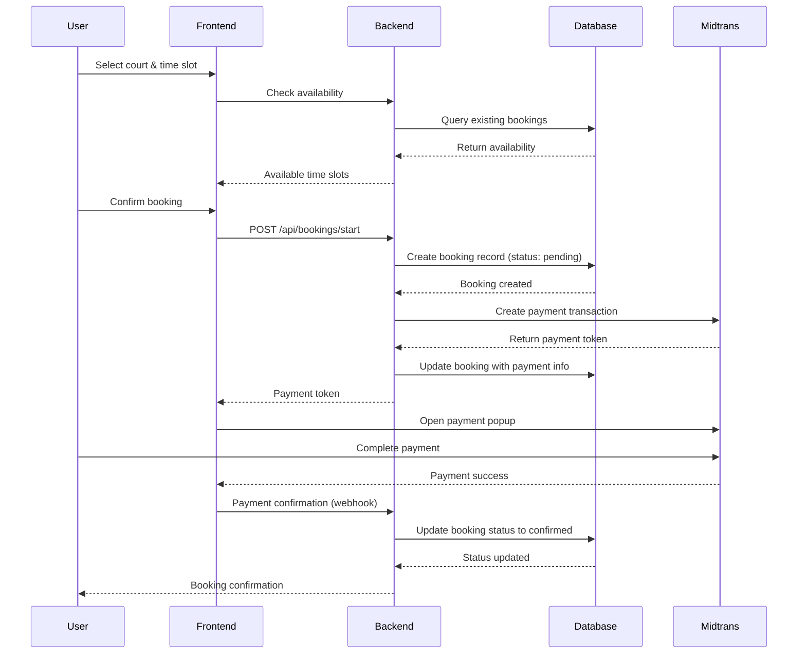

# Booking System & Database Schema Deep Dive

## Overview

Booking system adalah core feature dari Courtease yang mengintegrasikan:
- **Venue & Court Management**
- **Time Slot Booking**
- **Payment Processing**
- **Status Tracking**
- **Real-time Availability**

**Sumber:** [Booking System Best Practices](https://www.stytch.com/blog/build-a-booking-system)

## Database Schema Design

### Complete Schema Structure

```sql
-- Users & Profiles
CREATE TABLE profiles (
  id UUID REFERENCES auth.users(id) PRIMARY KEY,
  full_name TEXT,
  role TEXT DEFAULT 'user' CHECK (role IN ('user', 'venue_partner', 'admin')),
  phone TEXT,
  created_at TIMESTAMP DEFAULT NOW(),
  updated_at TIMESTAMP DEFAULT NOW()
);

-- Venues (Lapangan/Tempat Olahraga)
CREATE TABLE venues (
  id UUID DEFAULT gen_random_uuid() PRIMARY KEY,
  owner_id UUID REFERENCES profiles(id),
  name TEXT NOT NULL,
  slug TEXT UNIQUE NOT NULL,
  description TEXT,
  address TEXT,
  city TEXT,
  latitude DECIMAL(10, 8),
  longitude DECIMAL(11, 8),
  phone TEXT,
  website TEXT,
  operating_hours JSONB,
  facilities TEXT[],
  images TEXT[],
  is_active BOOLEAN DEFAULT true,
  created_at TIMESTAMP DEFAULT NOW(),
  updated_at TIMESTAMP DEFAULT NOW()
);

-- Courts (Lapangan Spesifik dalam Venue)
CREATE TABLE courts (
  id UUID DEFAULT gen_random_uuid() PRIMARY KEY,
  venue_id UUID REFERENCES venues(id) ON DELETE CASCADE,
  name TEXT NOT NULL,
  slug TEXT NOT NULL,
  sport_type TEXT NOT NULL, -- 'futsal', 'basketball', 'tennis', etc.
  price_per_hour DECIMAL(10, 2) NOT NULL,
  description TEXT,
  surface TEXT, -- 'artificial_turf', 'hard_court', etc.
  capacity INTEGER, -- number of players
  images TEXT[],
  is_active BOOLEAN DEFAULT true,
  created_at TIMESTAMP DEFAULT NOW(),
  updated_at TIMESTAMP DEFAULT NOW(),
  UNIQUE(venue_id, slug)
);

-- Bookings (Reservasi/Pemesanan)
CREATE TABLE bookings (
  id UUID DEFAULT gen_random_uuid() PRIMARY KEY,
  court_id UUID REFERENCES courts(id) ON DELETE RESTRICT,
  profile_id UUID REFERENCES profiles(id) ON DELETE RESTRICT,
  start_time TIMESTAMP WITH TIME ZONE NOT NULL,
  end_time TIMESTAMP WITH TIME ZONE NOT NULL,
  status TEXT DEFAULT 'pending' CHECK (status IN ('pending', 'confirmed', 'completed', 'cancelled')),
  payment_status TEXT DEFAULT 'pending' CHECK (payment_status IN ('pending', 'waiting_confirmation', 'paid', 'expired', 'cancelled')),
  payment_reference TEXT UNIQUE,
  payment_token TEXT,
  payment_redirect_url TEXT,
  payment_expired_at TIMESTAMP WITH TIME ZONE,
  price_total DECIMAL(10, 2) NOT NULL,
  notes TEXT,
  created_at TIMESTAMP DEFAULT NOW(),
  updated_at TIMESTAMP DEFAULT NOW(),

  -- Prevent double booking
  EXCLUDE (court_id WITH =) USING gist (
    court_id,
    tsrange(start_time, end_time)
  )
);

-- Availability / Time Slots
CREATE TABLE court_availability (
  id UUID DEFAULT gen_random_uuid() PRIMARY KEY,
  court_id UUID REFERENCES courts(id) ON DELETE CASCADE,
  date DATE NOT NULL,
  start_time TIME NOT NULL,
  end_time TIME NOT NULL,
  is_available BOOLEAN DEFAULT true,
  reason TEXT, -- 'maintenance', 'private_event', etc.
  created_at TIMESTAMP DEFAULT NOW(),
  UNIQUE(court_id, date, start_time, end_time)
);

-- Reviews & Ratings
CREATE TABLE court_reviews (
  id UUID DEFAULT gen_random_uuid() PRIMARY KEY,
  court_id UUID REFERENCES courts(id) ON DELETE CASCADE,
  booking_id UUID REFERENCES bookings(id) ON DELETE CASCADE,
  profile_id UUID REFERENCES profiles(id) ON DELETE CASCADE,
  rating INTEGER CHECK (rating >= 1 AND rating <= 5),
  review TEXT,
  would_recommend BOOLEAN,
  created_at TIMESTAMP DEFAULT NOW(),
  UNIQUE(booking_id) -- One review per booking
);
```

**Sumber:** [PostgreSQL Documentation](https://www.postgresql.org/docs/current/ddl-constraints.html)

### Database Indexes for Performance

```sql
-- Performance indexes
CREATE INDEX idx_venues_owner_id ON venues(owner_id);
CREATE INDEX idx_venues_city ON venues(city);
CREATE INDEX idx_venues_active ON venues(is_active);

CREATE INDEX idx_courts_venue_id ON courts(venue_id);
CREATE INDEX idx_courts_sport_type ON courts(sport_type);
CREATE INDEX idx_courts_active ON courts(is_active);

CREATE INDEX idx_bookings_profile_id ON bookings(profile_id);
CREATE INDEX idx_bookings_court_id ON bookings(court_id);
CREATE INDEX idx_bookings_status ON bookings(status);
CREATE INDEX idx_bookings_payment_status ON bookings(payment_status);
CREATE INDEX idx_bookings_start_time ON bookings(start_time);
CREATE INDEX idx_bookings_payment_reference ON bookings(payment_reference);

-- Composite indexes for common queries
CREATE INDEX idx_bookings_court_time ON bookings(court_id, start_time);
CREATE INDEX idx_bookings_user_status ON bookings(profile_id, status);

-- Availability indexes
CREATE INDEX idx_availability_court_date ON court_availability(court_id, date);
```

## Booking Flow Architecture

### End-to-End Booking Process



## API Implementation Analysis

### 1. Booking Creation API
```typescript
// app/api/bookings/start/route.ts
export async function POST(request: Request) {
  try {
    const supabase = await createClient();
    const user = await validateAuth(supabase); // 1. Authenticate user

    // 2. Validate and parse request body
    const body = await request.json();
    const courtId = validateRequired(body.courtId, "ID lapangan");
    const startDate = parseIsoDate(body.startTime);
    const endDate = parseIsoDate(body.endTime);
    validateDateRange(startDate, endDate);

    // 3. Fetch required data in parallel
    const [{ data: profile }, { data: court }] = await Promise.all([
      supabase
        .from("profiles")
        .select("full_name")
        .eq("id", user.id)
        .maybeSingle(),
      supabase
        .from("courts")
        .select("id, slug, name, price_per_hour, venue:venues(name, city)")
        .eq("id", courtId)
        .maybeSingle(),
    ]);

    if (!court) {
      throw new ApiError(404, "Lapangan tidak ditemukan.");
    }

    // 4. Calculate pricing
    const durationHours = Math.max(1, (endDate.getTime() - startDate.getTime()) / 3_600_000);
    const pricePerHour = Number(court.price_per_hour ?? 0);
    const totalPrice = Math.ceil(pricePerHour * durationHours);

    if (!Number.isFinite(totalPrice) || totalPrice <= 0) {
      throw new ApiError(400, "Harga lapangan belum dikonfigurasi.");
    }

    // 5. Create booking record
    const paymentReference = `BOOK-${Date.now()}-${Math.floor(Math.random() * 1000)}`;

    const { data: booking, error: bookingError } = await supabase
      .from("bookings")
      .insert({
        court_id: court.id,
        profile_id: user.id,
        start_time: startDate.toISOString(),
        end_time: endDate.toISOString(),
        status: "pending",
        payment_status: "pending",
        payment_reference: paymentReference,
        price_total: totalPrice,
        notes: body.notes?.trim() || null,
      })
      .select("id")
      .maybeSingle();

    if (bookingError || !booking) {
      throw new ApiError(500, "Tidak dapat membuat data booking.");
    }

    // 6. Create Midtrans transaction
    const successRedirectUrl = `${origin}/dashboard/user/bookings/${booking.id}`;

    const paymentResult = await createMidtransTransaction({
      orderId: paymentReference,
      amount: totalPrice,
      courtName: court.name,
      successRedirectUrl,
      customer: {
        firstName: profile?.full_name ?? user.email?.split("@")[0],
        email: user.email!,
      },
    });

    // 7. Update booking with payment metadata
    const paymentExpiresAt = new Date(Date.now() + 3 * 60 * 60 * 1000).toISOString();

    await supabase
      .from("bookings")
      .update({
        payment_token: paymentResult.token,
        payment_redirect_url: paymentResult.redirect_url ?? null,
        payment_expired_at: paymentExpiresAt,
      })
      .eq("id", booking.id);

    return createSuccessResponse({
      bookingId: booking.id,
      payment: {
        token: paymentResult.token,
        redirectUrl: paymentResult.redirect_url ?? null,
        expiresAt: paymentExpiresAt,
      },
    });

  } catch (error) {
    // 8. Cleanup and error handling
    if (booking && error instanceof ApiError) {
      // Cancel booking if payment fails
      await supabase
        .from("bookings")
        .update({ status: "cancelled", payment_status: "cancelled" })
        .eq("id", booking.id);
    }

    return handleApiError(error, "booking/start");
  }
}
```

### 2. Time Slot Validation
```typescript
// lib/booking/validation.ts
export function validateDateRange(startDate: Date, endDate: Date): void {
  const now = new Date();

  // Check if start time is in the future
  if (startDate.getTime() <= now.getTime()) {
    throw new ApiError(400, "Waktu mulai harus di masa depan.");
  }

  // Check if end time is after start time
  if (endDate.getTime() <= startDate.getTime()) {
    throw new ApiError(400, "Waktu selesai harus setelah waktu mulai.");
  }

  // Check minimum booking duration (1 hour)
  const minDuration = 60 * 60 * 1000; // 1 hour in milliseconds
  if (endDate.getTime() - startDate.getTime() < minDuration) {
    throw new ApiError(400, "Durasi booking minimal 1 jam.");
  }

  // Check maximum booking duration (8 hours)
  const maxDuration = 8 * 60 * 60 * 1000; // 8 hours
  if (endDate.getTime() - startDate.getTime() > maxDuration) {
    throw new ApiError(400, "Durasi booking maksimal 8 jam.");
  }

  // Check if booking is not too far in advance (30 days)
  const maxAdvanceBooking = 30 * 24 * 60 * 60 * 1000; // 30 days
  if (startDate.getTime() - now.getTime() > maxAdvanceBooking) {
    throw new ApiError(400, "Booking maksimal 30 hari ke depan.");
  }
}

export async function checkCourtAvailability(
  supabase: SupabaseClient,
  courtId: string,
  startTime: Date,
  endTime: Date
): Promise<boolean> {
  const { data: existingBookings } = await supabase
    .from("bookings")
    .select("id")
    .eq("court_id", courtId)
    .in("status", ["pending", "confirmed"])
    .or(`start_time.lte.${endTime.toISOString()},end_time.gte.${startTime.toISOString()}`);

  return !existingBookings || existingBookings.length === 0;
}
```

## Status Management System

### Status Type Definitions
```typescript
// lib/supabase/status.ts
export const BOOKING_STATUS_VALUES = [
  "pending",      // Booking created, waiting for payment
  "confirmed",    // Payment completed, booking confirmed
  "completed",    // Booking time has passed, service completed
  "cancelled",    // Booking cancelled by user or system
] as const;

export const PAYMENT_STATUS_VALUES = [
  "pending",              // Waiting for payment
  "waiting_confirmation", // Payment initiated, waiting for confirmation
  "paid",                 // Payment completed and confirmed
  "expired",              // Payment window expired
  "cancelled",            // Payment cancelled or failed
] as const;

export type BookingStatus = (typeof BOOKING_STATUS_VALUES)[number];
export type PaymentStatus = (typeof PAYMENT_STATUS_VALUES)[number];
```

### Status Transitions Logic
```typescript
// lib/booking/status-transitions.ts
export interface StatusTransition {
  from: BookingStatus;
  to: BookingStatus;
  condition?: (booking: any) => boolean;
  action?: (booking: any) => Promise<void>;
}

export const BOOKING_STATUS_TRANSITIONS: StatusTransition[] = [
  {
    from: "pending",
    to: "confirmed",
    condition: (booking) => booking.payment_status === "paid",
  },
  {
    from: "confirmed",
    to: "completed",
    condition: (booking) => new Date(booking.end_time) < new Date(),
  },
  {
    from: "pending",
    to: "cancelled",
    condition: (booking) =>
      booking.payment_status === "expired" ||
      booking.payment_status === "cancelled",
  },
  {
    from: "confirmed",
    to: "cancelled",
    action: async (booking) => {
      // Process refund if applicable
      await processRefund(booking);
    },
  },
];

export function isValidStatusTransition(
  from: BookingStatus,
  to: BookingStatus,
  booking?: any
): boolean {
  const transition = BOOKING_STATUS_TRANSITIONS.find(
    t => t.from === from && t.to === to
  );

  if (!transition) return false;

  if (transition.condition && booking) {
    return transition.condition(booking);
  }

  return true;
}
```

## Real-time Availability System

### Availability Checking
```typescript
// lib/booking/availability.ts
export async function getCourtAvailability(
  supabase: SupabaseClient,
  courtId: string,
  date: string // YYYY-MM-DD format
): Promise<TimeSlot[]> {
  const startOfDay = new Date(date);
  const endOfDay = new Date(date);
  endOfDay.setDate(endOfDay.getDate() + 1);

  // Get existing bookings for the date
  const { data: bookings } = await supabase
    .from("bookings")
    .select("start_time, end_time")
    .eq("court_id", courtId)
    .in("status", ["pending", "confirmed"])
    .gte("start_time", startOfDay.toISOString())
    .lt("start_time", endOfDay.toISOString());

  // Get court availability schedule
  const { data: schedule } = await supabase
    .from("court_availability")
    .select("*")
    .eq("court_id", courtId)
    .eq("date", date)
    .eq("is_available", true);

  // Generate available time slots
  return generateTimeSlots(bookings || [], schedule || []);
}

function generateTimeSlots(
  bookings: Array<{ start_time: string; end_time: string }>,
  schedule: CourtAvailability[]
): TimeSlot[] {
  const slots: TimeSlot[] = [];
  const dayStart = 6; // 6 AM
  const dayEnd = 22; // 10 PM
  const slotDuration = 60; // 1 hour slots

  for (let hour = dayStart; hour < dayEnd; hour++) {
    const slotStart = new Date();
    slotStart.setHours(hour, 0, 0, 0);

    const slotEnd = new Date(slotStart);
    slotEnd.setMinutes(slotDuration);

    // Check if slot conflicts with existing bookings
    const isBooked = bookings.some(booking => {
      const bookingStart = new Date(booking.start_time);
      const bookingEnd = new Date(booking.end_time);

      return (
        (slotStart >= bookingStart && slotStart < bookingEnd) ||
        (slotEnd > bookingStart && slotEnd <= bookingEnd) ||
        (slotStart <= bookingStart && slotEnd >= bookingEnd)
      );
    });

    // Check if slot is within available schedule
    const isScheduled = schedule.some(avail => {
      const scheduleStart = new Date(`${avail.date} ${avail.start_time}`);
      const scheduleEnd = new Date(`${avail.date} ${avail.end_time}`);

      return slotStart >= scheduleStart && slotEnd <= scheduleEnd;
    });

    if (!isBooked && (schedule.length === 0 || isScheduled)) {
      slots.push({
        start: slotStart,
        end: slotEnd,
        available: true,
        price: calculatePriceForSlot(slotStart, slotEnd),
      });
    }
  }

  return slots;
}
```

### Real-time Updates
```typescript
// hooks/use-realtime-availability.ts
"use client";

import { useEffect, useState } from "react";
import { createClient } from "@/lib/supabase/client";

export function useRealtimeAvailability(courtId: string, date: string) {
  const [availability, setAvailability] = useState<TimeSlot[]>([]);
  const [loading, setLoading] = useState(true);

  useEffect(() => {
    const supabase = createClient();

    // Initial fetch
    fetchAvailability();

    // Subscribe to real-time updates
    const channel = supabase
      .channel('availability-changes')
      .on(
        'postgres_changes',
        {
          event: '*',
          schema: 'public',
          table: 'bookings',
          filter: `court_id=eq.${courtId}`,
        },
        (payload) => {
          console.log('Booking changed:', payload);
          fetchAvailability(); // Refresh availability
        }
      )
      .subscribe();

    return () => {
      supabase.removeChannel(channel);
    };

    async function fetchAvailability() {
      setLoading(true);
      try {
        const response = await fetch(`/api/courts/${courtId}/availability?date=${date}`);
        const data = await response.json();
        setAvailability(data.slots || []);
      } catch (error) {
        console.error('Failed to fetch availability:', error);
      } finally {
        setLoading(false);
      }
    }
  }, [courtId, date]);

  return { availability, loading };
}
```

## Advanced Features

### 1. Recurring Bookings
```typescript
// lib/booking/recurring.ts
export interface RecurringPattern {
  frequency: 'daily' | 'weekly' | 'monthly';
  interval: number; // Every N days/weeks/months
  endDate: Date;
  daysOfWeek?: number[]; // For weekly pattern: 0 = Sunday, 6 = Saturday
}

export async function createRecurringBookings(
  supabase: SupabaseClient,
  courtId: string,
  userId: string,
  pattern: RecurringPattern,
  startTime: Date,
  endTime: Date
): Promise<string[]> {
  const bookingIds: string[] = [];
  const currentDate = new Date(startTime);

  while (currentDate <= pattern.endDate) {
    // Check if current date matches the pattern
    if (matchesPattern(currentDate, pattern)) {
      const slotStart = new Date(currentDate);
      const slotStart.setHours(startTime.getHours(), startTime.getMinutes());

      const slotEnd = new Date(currentDate);
      slotEnd.setHours(endTime.getHours(), endTime.getMinutes());

      // Check availability
      const isAvailable = await checkCourtAvailability(
        supabase,
        courtId,
        slotStart,
        slotEnd
      );

      if (isAvailable) {
        const { data: booking } = await supabase
          .from("bookings")
          .insert({
            court_id: courtId,
            profile_id: userId,
            start_time: slotStart.toISOString(),
            end_time: slotEnd.toISOString(),
            status: "pending",
            payment_status: "pending",
            price_total: calculatePrice(courtId, slotStart, slotEnd),
            is_recurring: true,
            recurring_pattern: pattern,
          })
          .select("id")
          .single();

        if (booking) {
          bookingIds.push(booking.id);
        }
      }
    }

    // Move to next occurrence
    incrementDate(currentDate, pattern);
  }

  return bookingIds;
}
```

### 2. Waitlist System
```typescript
// lib/booking/waitlist.ts
export async function addToWaitlist(
  supabase: SupabaseClient,
  courtId: string,
  userId: string,
  startTime: Date,
  endTime: Date
): Promise<string> {
  const { data, error } = await supabase
    .from("booking_waitlist")
    .insert({
      court_id: courtId,
      profile_id: userId,
      start_time: startTime.toISOString(),
      end_time: endTime.toISOString(),
      status: "waiting",
    })
    .select("id")
    .single();

  if (error) {
    throw new Error("Failed to add to waitlist");
  }

  // Notify user about waitlist position
  await notifyWaitlistPosition(userId, data.id);

  return data.id;
}

export async function processWaitlist(
  supabase: SupabaseClient,
  courtId: string,
  startTime: Date,
  endTime: Date
): Promise<void> {
  // Get waitlist entries for this time slot
  const { data: waitlist } = await supabase
    .from("booking_waitlist")
    .select("*")
    .eq("court_id", courtId)
    .eq("start_time", startTime.toISOString())
    .eq("end_time", endTime.toISOString())
    .eq("status", "waiting")
    .order("created_at", { ascending: true })
    .limit(1);

  if (waitlist && waitlist.length > 0) {
    const firstInLine = waitlist[0];

    // Create booking for first person in waitlist
    const { error } = await supabase
      .from("bookings")
      .insert({
        court_id: courtId,
        profile_id: firstInLine.profile_id,
        start_time: startTime.toISOString(),
        end_time: endTime.toISOString(),
        status: "confirmed",
        payment_status: "pending",
        price_total: calculatePrice(courtId, startTime, endTime),
      });

    if (!error) {
      // Update waitlist status
      await supabase
        .from("booking_waitlist")
        .update({ status: "booked" })
        .eq("id", firstInLine.id);

      // Notify user
      await notifyBookingAvailable(firstInLine.profile_id, courtId, startTime);
    }
  }
}
```

## Performance Optimization

### 1. Caching Strategy
```typescript
// lib/booking/cache.ts
import { LRUCache } from 'lru-cache';

const availabilityCache = new LRUCache<string, TimeSlot[]>({
  max: 1000, // Max 1000 cached results
  ttl: 1000 * 60 * 15, // 15 minutes TTL
});

export async function getCachedAvailability(
  courtId: string,
  date: string
): Promise<TimeSlot[]> {
  const cacheKey = `${courtId}:${date}`;

  // Check cache first
  let availability = availabilityCache.get(cacheKey);

  if (!availability) {
    // Fetch from database if not in cache
    availability = await fetchAvailabilityFromDB(courtId, date);
    availabilityCache.set(cacheKey, availability);
  }

  return availability;
}

export function invalidateAvailabilityCache(courtId: string, date?: string): void {
  if (date) {
    availabilityCache.delete(`${courtId}:${date}`);
  } else {
    // Invalidate all entries for this court
    const keys = Array.from(availabilityCache.keys())
      .filter(key => key.startsWith(`${courtId}:`));

    keys.forEach(key => availabilityCache.delete(key));
  }
}
```

### 2. Database Query Optimization
```typescript
// lib/booking/queries.ts
export async function getBookingsOptimized(
  supabase: SupabaseClient,
  userId: string,
  filters: BookingFilters
): Promise<BookingWithDetails[]> {
  // Use CTE for complex filtering
  const { data } = await supabase.rpc('get_user_bookings_with_details', {
    p_user_id: userId,
    p_status: filters.status || null,
    p_date_from: filters.dateFrom?.toISOString() || null,
    p_date_to: filters.dateTo?.toISOString() || null,
    p_limit: filters.limit || 50,
    p_offset: filters.offset || 0,
  });

  return data || [];
}

// PostgreSQL function for optimized query
/*
CREATE OR REPLACE FUNCTION get_user_bookings_with_details(
  p_user_id UUID,
  p_status TEXT DEFAULT NULL,
  p_date_from TIMESTAMP WITH TIME ZONE DEFAULT NULL,
  p_date_to TIMESTAMP WITH TIME ZONE DEFAULT NULL,
  p_limit INTEGER DEFAULT 50,
  p_offset INTEGER DEFAULT 0
)
RETURNS TABLE (
  id UUID,
  court_id UUID,
  court_name TEXT,
  venue_name TEXT,
  start_time TIMESTAMP WITH TIME ZONE,
  end_time TIMESTAMP WITH TIME ZONE,
  status TEXT,
  payment_status TEXT,
  price_total DECIMAL
) AS $$
BEGIN
  RETURN QUERY
  SELECT
    b.id,
    b.court_id,
    c.name AS court_name,
    v.name AS venue_name,
    b.start_time,
    b.end_time,
    b.status,
    b.payment_status,
    b.price_total
  FROM bookings b
  JOIN courts c ON b.court_id = c.id
  JOIN venues v ON c.venue_id = v.id
  WHERE b.profile_id = p_user_id
    AND (p_status IS NULL OR b.status = p_status)
    AND (p_date_from IS NULL OR b.start_time >= p_date_from)
    AND (p_date_to IS NULL OR b.start_time <= p_date_to)
  ORDER BY b.start_time DESC
  LIMIT p_limit OFFSET p_offset;
END;
$$ LANGUAGE plpgsql;
*/
```

## Testing Strategy

### 1. Unit Tests
```typescript
// tests/booking.test.ts
describe('Booking System', () => {
  test('Should create booking with valid data', async () => {
    const bookingData = {
      courtId: 'court-123',
      startTime: '2024-12-25T10:00:00Z',
      endTime: '2024-12-25T12:00:00Z',
    };

    const response = await createBooking(bookingData);

    expect(response.status).toBe(201);
    expect(response.data.bookingId).toBeDefined();
    expect(response.data.payment.token).toBeDefined();
  });

  test('Should reject double booking', async () => {
    const slot = {
      courtId: 'court-123',
      startTime: '2024-12-25T10:00:00Z',
      endTime: '2024-12-25T12:00:00Z',
    };

    // First booking should succeed
    await createBooking(slot);

    // Second booking should fail
    await expect(createBooking(slot)).rejects.toThrow('Time slot not available');
  });

  test('Should validate time range correctly', () => {
    expect(() => validateDateRange(
      new Date('2024-12-25T10:00:00Z'),
      new Date('2024-12-25T09:00:00Z')
    )).toThrow('Waktu selesai harus setelah waktu mulai');

    expect(() => validateDateRange(
      new Date(Date.now() - 1000), // Past time
      new Date(Date.now() + 3600000) // Future time
    )).toThrow('Waktu mulai harus di masa depan');
  });
});
```

### 2. Integration Tests
```typescript
// tests/booking-integration.test.ts
describe('Booking Integration', () => {
  test('Complete booking flow', async () => {
    // 1. User selects court and time slot
    const availability = await getAvailability('court-123', '2024-12-25');
    expect(availability).toHaveLength(greaterThan(0));

    // 2. Create booking
    const booking = await createBooking({
      courtId: 'court-123',
      startTime: '2024-12-25T10:00:00Z',
      endTime: '2024-12-25T12:00:00Z',
    });

    // 3. Process payment (simulate Midtrans webhook)
    await processPaymentWebhook({
      order_id: booking.paymentReference,
      transaction_status: 'settlement',
    });

    // 4. Verify booking status
    const updatedBooking = await getBooking(booking.bookingId);
    expect(updatedBooking.status).toBe('confirmed');
    expect(updatedBooking.payment_status).toBe('paid');
  });
});
```

---

**Key Takeaways:**
1. **Schema Design**: Proper relationships, constraints, and indexing
2. **Status Management**: Clear state transitions and validation
3. **Real-time**: Live availability updates using Supabase subscriptions
4. **Performance**: Caching, optimized queries, and database indexes
5. **Testing**: Comprehensive unit and integration test coverage
6. **Advanced Features**: Recurring bookings, waitlist system
