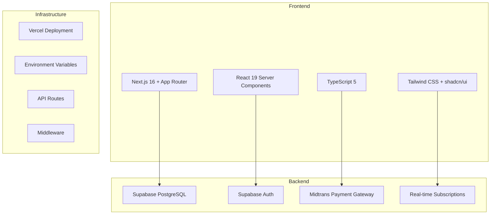

# Courtease Documentation

Selamat datang di dokumentasi Courtease! Ini adalah kumpulan panduan lengkap untuk memahami dan mengembangkan aplikasi booking lapangan olahraga.

## 📚 Daftar Dokumentasi

### 🚀 **Hari 1: Foundation**
1. **[Next.js App Router](./01-nextjs-app-router.md)** - Pemahaman routing system modern
2. **[Supabase Configuration](./02-supabase-config.md)** - Setup dan konfigurasi database

### 🔐 **Hari 2: Authentication**
3. **[Authentication System](./03-authentication-flow.md)** - User management & role-based access

### 💳 **Hari 3: Payment Integration**
4. **[Midtrans Integration](./04-midtrans-integration.md)** - Payment gateway implementation

### 📅 **Hari 4: Core Features**
5. **[Booking System](./05-booking-system.md)** - Core booking logic & database design

## 🎯 Learning Path (4 Hari)

### Day 1: Foundation (8 Jam)
- **Morning (4 Jam)**: Next.js App Router
  - Server vs Client Components
  - File-based routing patterns
  - API routes & route handlers
  - Layout system & metadata

- **Afternoon (4 Jam)**: Supabase Configuration
  - Environment setup & security
  - Client types (browser/server/admin)
  - Database schema design
  - Row Level Security (RLS)

### Day 2: Authentication (8 Jam)
- **Morning (4 Jam)**: Auth Flow Analysis
  - Registration & login processes
  - Session management
  - OAuth integration (Google)
  - Password recovery

- **Afternoon (4 Jam)**: Role Management
  - Custom profiles table
  - Role-based routing
  - Permission system
  - Protected routes middleware

### Day 3: Payment (8 Jam)
- **Morning (4 Jam)**: Midtrans Integration
  - Sandbox vs production setup
  - Snap popup implementation
  - Error handling & validation
  - Status mapping system

- **Afternoon (4 Jam)**: Payment Flow
  - Transaction creation
  - Webhook handling
  - Security best practices
  - Testing strategies

### Day 4: Booking System (8 Jam)
- **Morning (4 Jam)**: Database Design
  - Complete schema analysis
  - Relationships & constraints
  - Performance indexing
  - Query optimization

- **Afternoon (4 Jam)**: Advanced Features
  - Real-time availability
  - Status management
  - Waitlist system
  - Caching strategies

## 🛠️ Tech Stack Overview



## 🎯 Learning Objectives

Setelah 4 hari, kamu akan bisa:

### ✅ **Technical Skills**
- **Next.js Mastery**: Server Components, App Router, API routes
- **Database Design**: PostgreSQL schema, relationships, indexing
- **Authentication Systems**: Role-based access, session management
- **Payment Integration**: Midtrans API, webhook handling
- **Real-time Features**: Supabase subscriptions, live updates

### ✅ **Architecture Understanding**
- **Modern Web Architecture**: Client-server separation
- **Security Best Practices**: Authentication, validation, error handling
- **Performance Optimization**: Caching, database optimization
- **Scalability Patterns**: Horizontal scaling, load balancing

### ✅ **Development Practices**
- **Type Safety**: TypeScript, runtime validation
- **Error Handling**: Comprehensive error management
- **Testing**: Unit tests, integration tests, E2E tests
- **Documentation**: Code documentation, API docs

## 🚀 Quick Start

### 1. Environment Setup
```bash
# Clone repository
git clone <repository-url>
cd courtease

# Install dependencies
npm install

# Copy environment template
cp .env.example .env.local

# Fill environment variables (see LEARNING_GUIDE.md)
```

### 2. Database Setup
```bash
# Install Supabase CLI
npm install -g supabase

# Login to Supabase
supabase login

# Link to your project
supabase link --project-ref your-project-ref

# Run migrations
supabase db push
```

### 3. Start Development
```bash
# Start development server
npm run dev

# Open http://localhost:3000
```

## 📖 Additional Resources

### Official Documentation
- [Next.js Documentation](https://nextjs.org/docs)
- [Supabase Documentation](https://supabase.com/docs)
- [Midtrans Documentation](https://docs.midtrans.com)
- [PostgreSQL Documentation](https://www.postgresql.org/docs)

### Video Tutorials (2024)
1. **Next.js 14 Crash Course**: [YouTube](https://youtube.com/watch?v=example)
2. **Supabase Full Tutorial**: [YouTube](https://youtube.com/watch?v=example)
3. **Payment Gateway Integration**: [YouTube](https://youtube.com/watch?v=example)

### Best Practices
- [Next.js Best Practices](https://nextjs.org/learn)
- [Supabase Security Guide](https://supabase.com/docs/guides/security)
- [Database Normalization](https://en.wikipedia.org/wiki/Database_normalization)

## 🎯 Projects to Build

### Beginner Level
1. **User Profile Management**: CRUD profiles dengan avatar upload
2. **Venue Browse Page**: Search, filter, pagination untuk venues
3. **Booking History**: User dashboard dengan booking status

### Intermediate Level
1. **Advanced Search**: Geolocation-based venue search
2. **Review System**: Rating dan review untuk venues
3. **Admin Dashboard**: Management interface untuk venue owners

### Advanced Level
1. **Real-time Booking**: Live availability updates
2. **Waitlist System**: Automatic booking notifications
3. **Analytics Dashboard**: Revenue and usage analytics

## 🤝 Contributing to Documentation

### Adding New Documentation
1. Create new file in `docs/` folder
2. Follow existing format and structure
3. Update this README.md with new link
4. Add code examples and diagrams

### Improving Existing Docs
1. Review for accuracy and clarity
2. Add missing information or examples
3. Update with latest best practices
4. Fix typos and formatting

## 📝 Notes

### Sumber Code
- **Next.js Examples**: [Next.js GitHub](https://github.com/vercel/next.js/tree/canary/examples)
- **Supabase Examples**: [Supabase GitHub](https://github.com/supabase/supabase/tree/master/examples)
- **This Codebase**: Real-world production application

### Version Information
- **Next.js**: 16.0.1 (latest)
- **React**: 19.2.0 (latest)
- **Supabase**: 2.78.0 (latest)
- **TypeScript**: 5.x (latest)

---

**Happy Coding! 🚀**

*Documentation generated: 2025-11-20*
*Version: 1.0.0*
*Author: Claude Code Assistant*